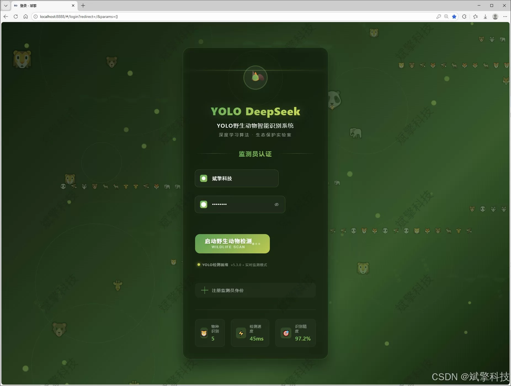
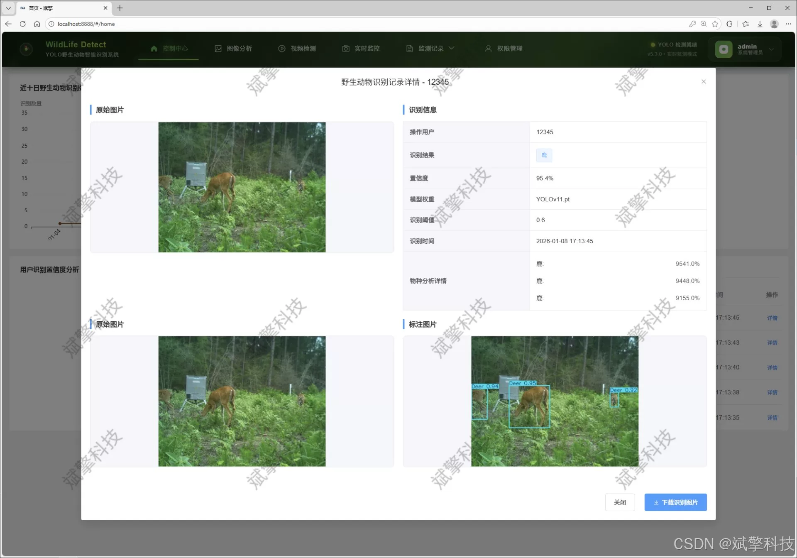
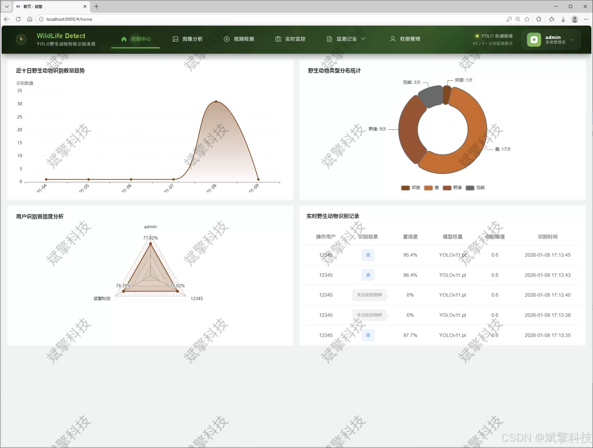
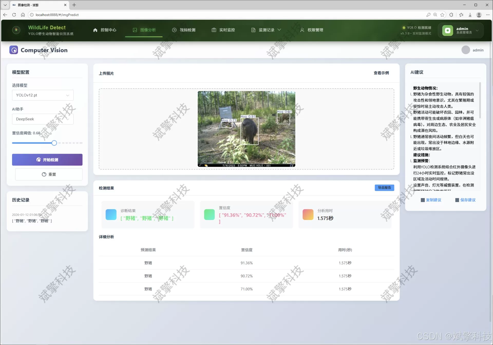
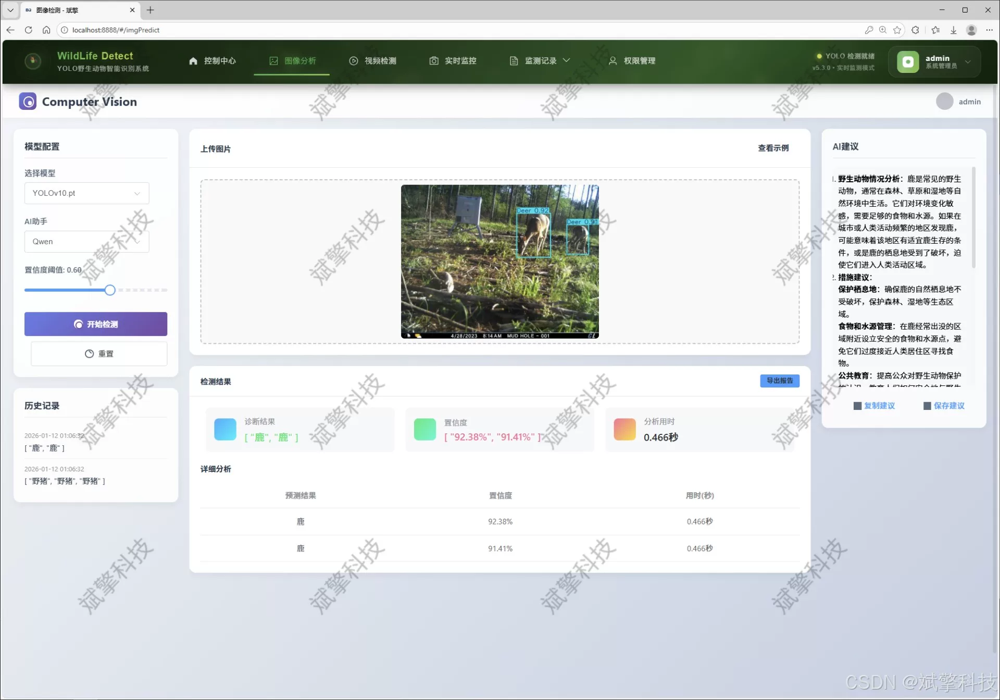
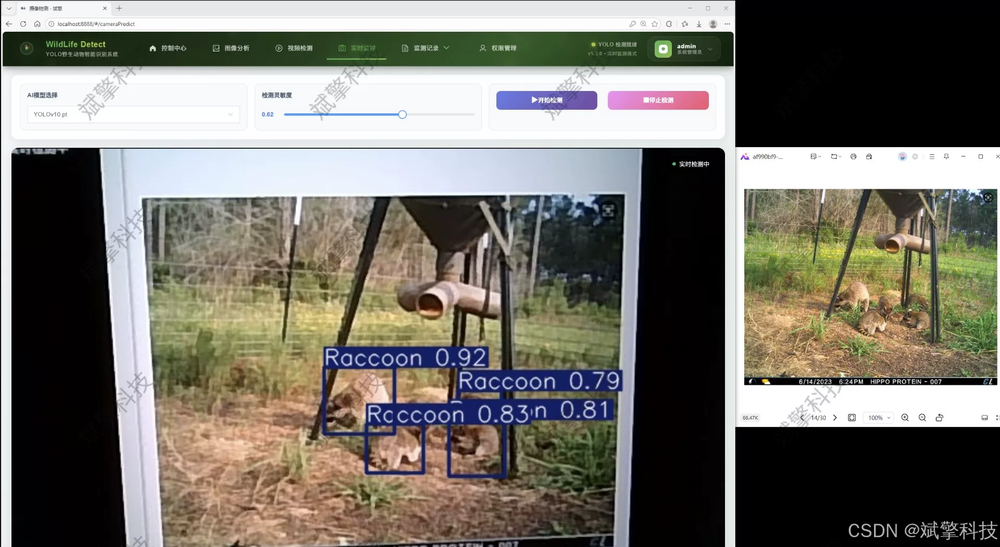
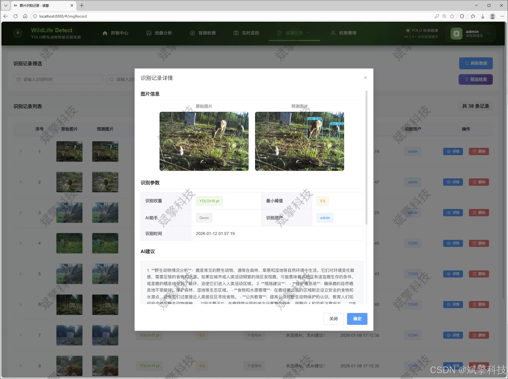
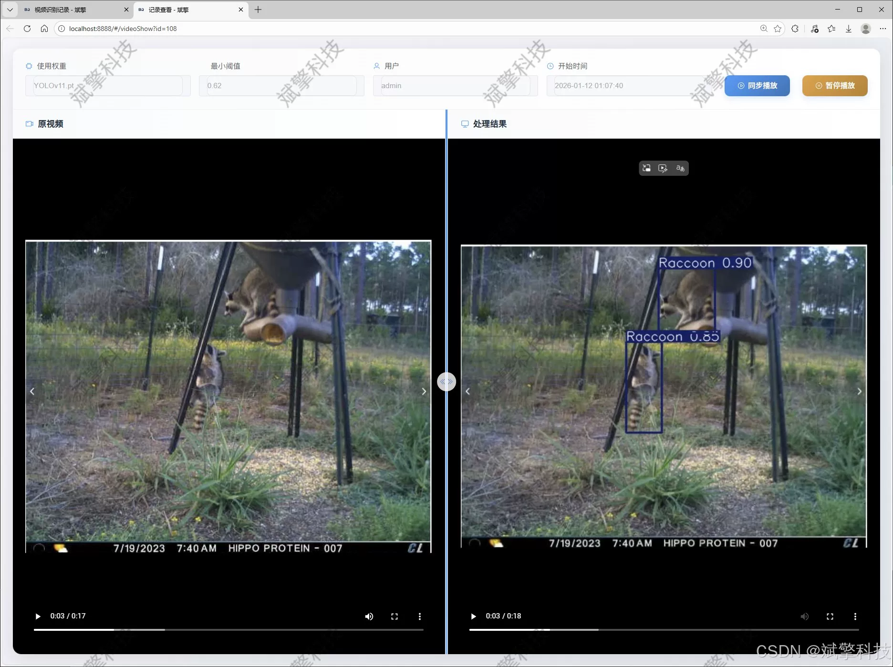
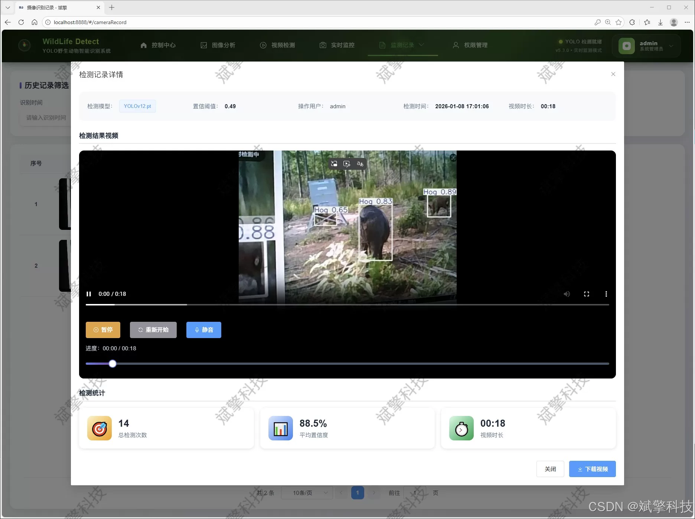

# YOLO Wildlife Detection System

## Body

YOLO Wildlife Detection System Based on YOLO Deep Learning and Large Models like Qianwen, DeepSeek for Wildlife Detection (DeepSeek Intelligent Analysis + Web Interaction Interface + Front-end-Backend Separation + YOLO Data + YOLOv8/YOLOv10/YOLOv11/YOLOv12)

The core of the system uses the current frontier YOLOv8, YOLOv10, YOLOv11, and YOLOv12 models as detection engines to build a high-precision, high-efficiency wildlife recognition model. For five common but ecologically significant animals such as Coyote, Deer, Hog, Rabbit, and Raccoon, we have built a specialized dataset containing 10,665 training images, 928 validation images, and 536 test images, ensuring the sufficient training of the model and the reliability of the evaluation.

The backend service is based on SpringBoot framework, adopting a front-end-back-end separation architecture to ensure high cohesion, low coupling, and good scalability. The front end provides an intuitive Web interaction interface, supporting user registration and login (information encrypted stored in MySQL database), model switching, detection task initiation, and result management. The system is comprehensive, not only supporting wildlife detection from image and video files as well as real-time camera streams, but also structuring all detection records (including original files, detection results, timestamps, etc.) into a database for easy traceability and analysis.

Moreover, this system deeply integrates the intelligent analysis capabilities of the DeepSeek large language model. After completing target detection, it can perform deep analysis on the recognition results, including ecological significance and behavioral interpretation, enhancing the application value of the data. The system also comes with a complete data visualization dashboard, displaying information on detection statistics, species distribution, etc., and providing modules for user management and personal center, realizing a complete closed-loop from data collection, intelligent recognition, result analysis to system management.

Functional modules

✅ User login registration: Support password authentication, saved to MySQL database.

✅ Support four types of YOLO models switch, YOLOv8, YOLOv10, YOLOv11, YOLOv12.

✅ Information visualization, data visualization.

✅ Image detection support AI analysis function, DeepSeek and Qianwen.

✅ Support image detection, video detection, and real-time camera detection, detection results saved to MySQL database.

✅ Image recognition record management, video recognition record management, and camera recognition record management.

✅ User management module, administrators can add, delete, update, and view users.

✅ Personal center, which allows users to modify their information, password name profile picture and so on.

No lunwen ghostwriting services or any lunwen

## Images

## Payment

Here is a pay link on Stripe ( https://buy.stripe.com/3cs8yP7sY87d0vu9AB ). Please contact me lonlonago@foxmail.com after funding $89, and I will send you a complete data files , thank you!

